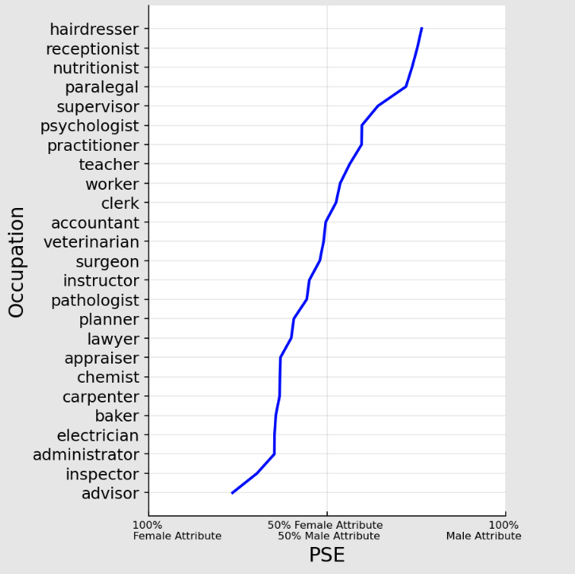

# `psycho_ai`: analyzing biases in AI models using Psychophysics

# Authors

- Lizhen Liang, Ph.D. student, Syracuse University
- Daniel E. Acuna, iSchool, Syracuse University

# Introduction
### Install:
```
pip install git+https://github.com/sciosci/psycho_ai
```

### 

# Examples

Extract PSE and JND of word embedding models:

```python
from psycho_ai import two_afc
pse_score = two_afc.pse(embedding, target_occupations, female_male_pairs)
jnd_score = two_afc.jnd(embedding_list,target_occupations, female_male_pairs)
```
PSE Output
```
{'advisor': 0.23486328125,
 'architect': 0.24462890625,
 'officer': 0.29150390625,
 ...
 ...
 ...
 'therapist': 0.7587890625,
 'hairdresser': 0.76513671875,
 'hygienist': 0.830078125}
 ```
 JND Output
 ```
{'janitor': 0.0010945320129394534,
 'technician': 0.0012115716934204103,
 'administrator': 0.0013679265975952148,
 ...
 ...
 ...
 'supervisor': 0.021092605590820313,
 'architect': 0.022199630737304688,
 'plumber': 0.02711360454559326}
 ```
 ### Plots
 ```python
 two_afc.plot_pse(pse_score)
 ```
 
# Citation

Please refer to

- Liang, L., & Acuna, D. E. (2020, January)
  . [Artificial mental phenomena: Psychophysics as a framework to detect perception biases in AI models](https://dl.acm.org/doi/abs/10.1145/3351095.3375623)
  . In Proceedings of the 2020 Conference on Fairness, Accountability, and Transparency (
  pp. 403-412).

